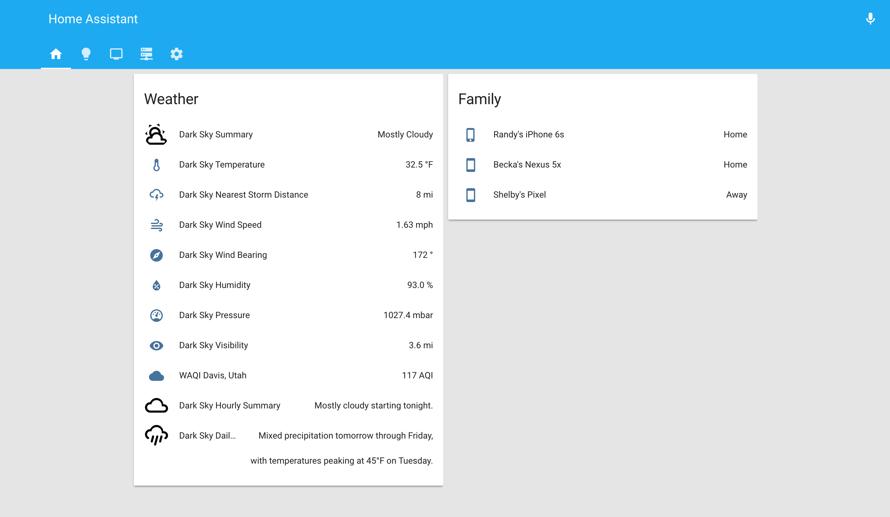
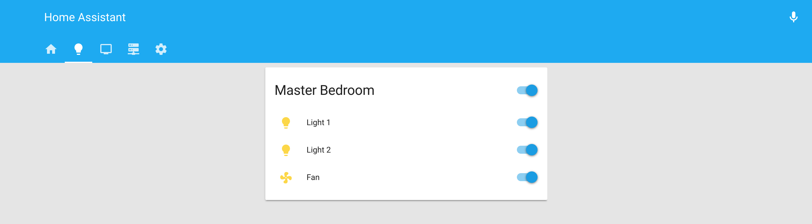
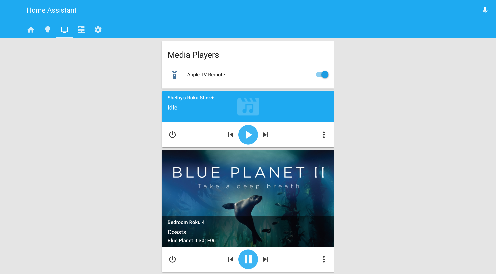
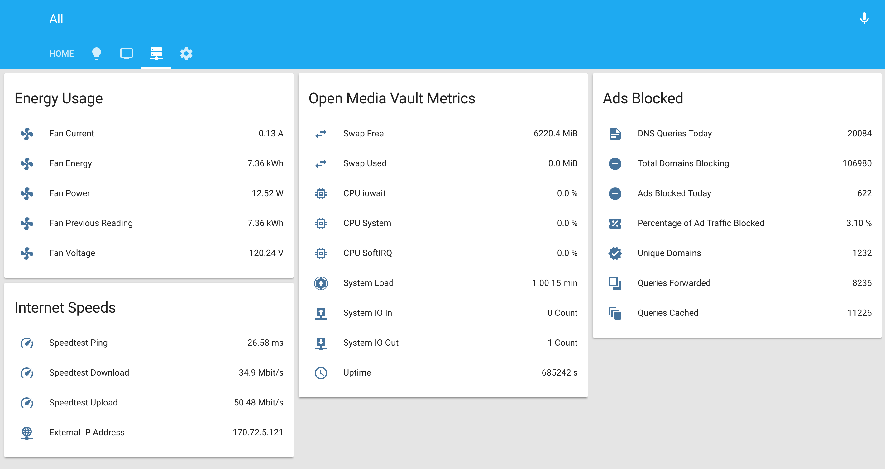

# HomeAssistant Configuration

Just starting to get things setup. I will be adding more configs and screenshots in the near future.

**Current Devices:**
* **HomeAssistant Software:**
* <a href="https://home-assistant.io/docs/installation/docker/">HomeAssistant Docker Container</a>
* **Media Players:**
* <a href="https://www.macworld.com/article/1154446/home-players/appletv2-review.html">Apple TV (2nd generation, late 2010)</a>
* <a href="https://www.androidcentral.com/sites/androidcentral.com/files/styles/xlarge_wm_brw/public/article_images/2014/04/chromecast_box_dongle.jpg?itok=9D3HQaD5">Google Chromecast (1st generation)</a>
* <a href="http://a.co/2dvToAN">Roku 4</a>
* <a href="http://a.co/7J19Dcy">Roku Streaming Stick+</a>
* **Smart Home Speakers:**
* <a href="http://a.co/9ZZNkE9">All-new Echo (2nd Generation)</a>
* <a href="https://store.google.com/product/google_home">Google Home</a>
* **Z-Wave Devices:**
* <a href="http://a.co/fFQtnuG">Aeotec Z-Stick Gen5 (ZW090)</a>
* <a href="http://a.co/eMdNBfE">Aeotec Smart Switch 6 (ZW096)</a>
* <a href="https://www.bestbuy.com/site/ge-z-wave-plus-wireless-smart-plug-in-dimmer-switch-white/6068002.p?skuId=6068002">GE Z-Wave Plus Smart Plug Dimmer Switch (ZW3106) w/Two independently controlled outlets</a>

## Home Screen

    

## Lights & Switches Screen

## Media Players Screen

## Network Monitoring Screen

### Coming Soon:
* Automation with lights and etc.     

(*NOTE: I've excluded secrets.yaml and known_devices.yaml for privacy/security*)   
