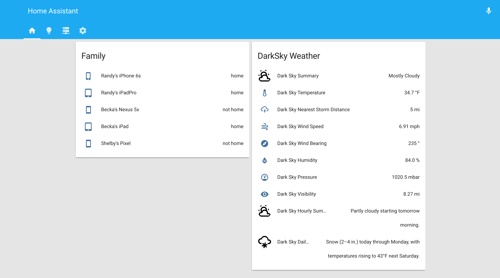
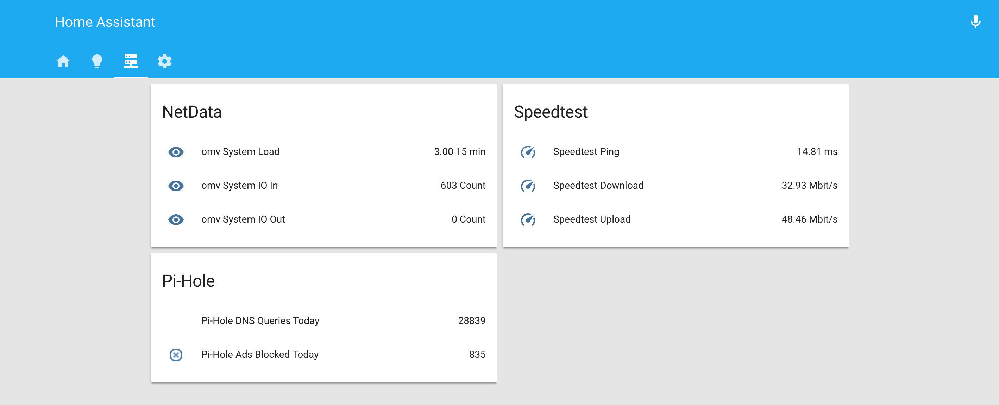

# HomeAssistant-Configs

Just starting to get things setup. I will be adding more configs and screenshots in the near future.

*NOTE: I've excluded secrets.yaml and known_devices.yaml for privacy/security*

### Home Screen
1. **Family**
  * This shows who's home. Uses the following configuration files ...
    1. device_tracking.yaml
    2. known_devices.yaml
    3. groups.yaml    

2. **DarkSky Weather**
  * Shows weather at home location. Uses the following configuration files ...
    1. sensor.yaml
    2. groups.yaml

    

### Server Screen
1. **NetData**
  * Shows stats from home storage server. Uses the following configuration files ...
    1. sensor.yaml
    2. groups.yaml

2. **Pi-Hole**
  * Shows stats from pi-hole DNS server. Uses the following configuration files ...
    1. sensor.yaml
    2. groups.yaml

3. **Speedtest**
  * Shows speedtest.net stats. Uses the following configuration files ...
    1. sensor.yaml
    2. groups.yaml

### Coming Soon:
* Z-Wave Plus stick
* Z-Wave Plus switch
* Z-Wave Plus plugs
* Automation with lights and etc.        
